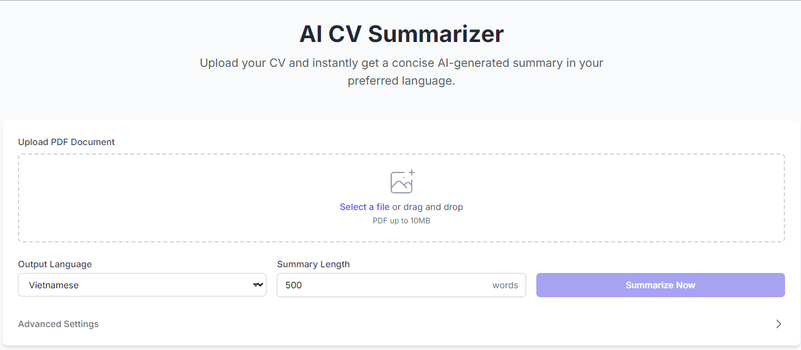

<!-- Improved compatibility of back to top link -->
<a id="readme-top"></a>

<!-- PROJECT SHIELDS -->

[![Contributors][contributors-shield]][contributors-url]
[![Forks][forks-shield]][forks-url]
[![Stars][stars-shield]][stars-url]
[![Issues][issues-shield]][issues-url]
[![License][license-shield]][license-url]
[![LinkedIn][linkedin-shield]][linkedin-url]

<!-- PROJECT LOGO -->
<br />
<div align="center">
  <a href="https://github.com/Grizmo2610/CVScanner">
    
  </a>

  <h3 align="center">CV AI Summarizer</h3>

  <p align="center">
    Scan, summarize, and evaluate how well a CV matches a job description
    <br />
    <a href="https://github.com/Grizmo2610/CVScanner"><strong>Explore the Docs »</strong></a>
    <br />
    <br />
    <a href="https://cv-ai-summarizer.onrender.com/">View Demo</a>
    ·
    <a href="https://github.com/Grizmo2610/CVScanner/issues/new?labels=bug&template=bug-report---.md">Report Bug</a>
    ·
    <a href="https://github.com/Grizmo2610/CVScanner/issues/new?labels=enhancement&template=feature-request---.md">Request Feature</a>
  </p>
</div>

---

## 📌 About The Project



Creating a resume is easier than ever, but with the rise of similar-looking CVs, recruiters often struggle to identify the best candidates quickly. Meanwhile, candidates may wonder how well their CV aligns with a job description.

**CV AI Summarizer** helps bridge that gap. It uses artificial intelligence to extract and summarize resume content (optional), compare it against job descriptions, and calculate a match percentage between the CV and JD. This allows recruiters—even without deep industry knowledge—to assess a CV's relevance to a position efficiently.

<p align="right">(<a href="#readme-top">back to top</a>)</p>

---

### 🛠️ Built With

[](https://www.python.org/)
[](https://flask.palletsprojects.com/)
[](https://en.wikipedia.org/wiki/Large_language_model)
[](https://pymupdf.readthedocs.io/)
[](https://developer.mozilla.org/en-US/docs/Web/HTML)
[](https://developer.mozilla.org/en-US/docs/Web/CSS)
[](https://developer.mozilla.org/en-US/docs/Web/JavaScript)

<p align="right">(<a href="#readme-top">back to top</a>)</p>

---

## 🚀 Getting Started

You can either use the demo version or set it up locally.

### 🔗 Demo
👉 [cv-ai-summarizer.onrender.com](https://cv-ai-summarizer.onrender.com/)

### 📦 Prerequisites

- Python 3.11 or higher
- `pip` installed
- Basic Python knowledge

### ⚙️ Installation (Windows)

```bash
git clone https://github.com/Grizmo2610/CVScanner.git
cd CVScanner
python -m venv venv
venv\Scripts\activate
pip install -r requirements.txt
```

1. Get a free API key from [Google AI](https://developers.google.com/maps/documentation/javascript/get-api-key)
2. Save your key in a file named `gemini.key`
3. Update `gemini_key_path` in `app.py` with the correct path to `gemini.key`
4. Run the app:

```bash
python app.py
```

5. Open [http://127.0.0.1:5000](http://127.0.0.1:5000) in your browser.

<p align="right">(<a href="#readme-top">back to top</a>)</p>

---

## 💡 Usage

1. Upload a PDF CV file
2. Customize:

   * **Output Language** (default: Vietnamese)
   * **Summary Length** (default: 500 words)
3. Click **Summarize**
<!-- 4. (Optional) Add a Job Description to get a match score -->

<p align="right">(<a href="#readme-top">back to top</a>)</p>

---

## 🗺️ Roadmap

* [x] PDF CV Parsing
* [ ] DOCX & Image Support
* [x] Content Summarization
* [x] Web Interface (HTML, CSS)
* [x] Flask Backend
* [x] Highlighted Results
* [x] GitHub Integration
* [ ] JD Input Features
  * [x] Manual Input
  * [ ] File Upload
* [ ] JD vs CV Matching Logic

See [open issues](https://github.com/Grizmo2610/CVScanner/issues) for planned features and bug reports.

<p align="right">(<a href="#readme-top">back to top</a>)</p>

---

## 🤝 Contributing

Contributions are what make the open-source community amazing. Any contributions are welcome!

1. Fork the repo
2. Create a new branch (`git checkout -b feature/AmazingFeature`)
3. Commit your changes
4. Push and open a Pull Request

⭐ Don’t forget to star this project if you find it helpful!

<p align="right">(<a href="#readme-top">back to top</a>)</p>

---

## 🪪 License

Distributed under the Apache License. See `LICENSE.txt` for details.

<p align="right">(<a href="#readme-top">back to top</a>)</p>

---

## 📬 Contact

**Hoàng Tuấn Tú** (aka **Grizmo**)
📧 [hoangtuantu893@gmail.com](mailto:hoangtuantu893@gmail.com)
🔗 [LinkedIn](https://www.linkedin.com/in/grizmo/)
🔗 [GitHub Project](https://github.com/Grizmo2610/CVScanner)

<p align="right">(<a href="#readme-top">back to top</a>)</p>

---

## 🙏 Acknowledgments

* [othneildrew's README Template](https://github.com/othneildrew/Best-README-Template)
* [GitHub Emoji Cheat Sheet](https://www.webpagefx.com/tools/emoji-cheat-sheet)
* [Choose an Open Source License](https://choosealicense.com)

---

<!-- MARKDOWN LINKS & IMAGES -->

[contributors-shield]: https://img.shields.io/github/contributors/Grizmo2610/CVScanner.svg?style=for-the-badge
[contributors-url]: https://github.com/Grizmo2610/CVScanner/graphs/contributors
[forks-shield]: https://img.shields.io/github/forks/Grizmo2610/CVScanner.svg?style=for-the-badge
[forks-url]: https://github.com/Grizmo2610/CVScanner/network/members
[stars-shield]: https://img.shields.io/github/stars/Grizmo2610/CVScanner.svg?style=for-the-badge
[stars-url]: https://github.com/Grizmo2610/CVScanner/stargazers
[issues-shield]: https://img.shields.io/github/issues/Grizmo2610/CVScanner.svg?style=for-the-badge
[issues-url]: https://github.com/Grizmo2610/CVScanner/issues
[license-shield]: https://img.shields.io/github/license/Grizmo2610/CVScanner.svg?style=for-the-badge
[license-url]: https://github.com/Grizmo2610/CVScanner/blob/master/LICENSE.txt
[linkedin-shield]: https://img.shields.io/badge/-LinkedIn-black.svg?style=for-the-badge&logo=linkedin&colorB=555
[linkedin-url]: https://linkedin.com/in/grizmo
